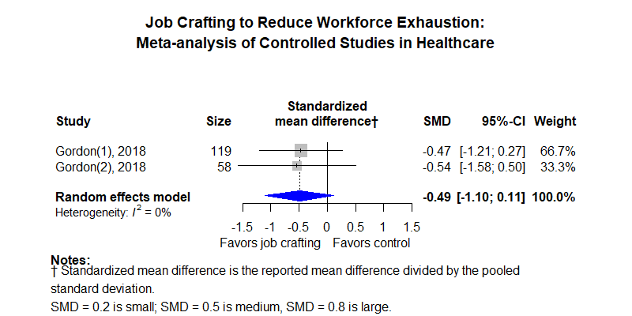

Job crafting
============================================
A living systematic review

Short url: https://ebmgt.github.io/job-crafting/

**Definitions** 
* "Job crafting" is "workers actively change the actual or perceived characteristics of their jobs in order to better match the demands placed on them and the resources available" (Topa and Aranda-Carmena, 2022 PMID [36232011](http://pubmed.gov/36232011))​
* "Collaborative job crafting" is "[workers] can jointly determine how to modify the work to meet their shared goals" (Topa and Aranda-Carmena, 2022 PMID [36232011](http://pubmed.gov/36232011))​
* Job crafting can be combined with "knowledge sharing", such as Googler2Googler (G2) in which the organization helps disseminate successful job crafting.

**Clinical summary:** This meta-analysis suggests that clinical intervention *is* moderately effective. [Standarized mean differences](https://training.cochrane.org/handbook/current/chapter-15#section-15-3) across outcomes range from 0.49 to 0.78. Heterogeneity of results as measured by I2 was '[moderate](https://training.cochrane.org/handbook/current/chapter-10#section-10-10-2)' at 0% for all analyses but very wide confidence intervals reflect the small number of studies and subjects. This review updates previously published meta-analysis(es).(citation[s] below)

Meta-regression of common modulators (year of publication, study size, event rate in the control groups) finds that the outcome of the intervention is effected by xx.

* [Reconciliation of studies and conclusions with prior meta-analyses](files/reconciliation-tables/Reconciliation%20of%20studies%20and%20conclusions.pdf) (under construction)
<!-- * [Keep current with this topic](files/searching/Keep-up.md) -->

Acknowledgement: we acknowledge the essential work by the authors of the prior [systematic review(s)](#systematic-reviews) listed below.

**Methods overview:** This repository is an [openMetaAnalysis](https://openmetaanalysis.github.io/) that combines methods of scoping, rapid, and living systematic reviews.  This analysis updates one or more previously published review(s) below. A comparison of studies included in this review compared to prior reviews are in the table, [reconciliation of trials included with prior meta-analyses/](files/reconciliation-tables/Reconciliation%20of%20studies.pdf). Newer studies included are listed in the references below. Rationale for newer trials excluded may be listed at the end of the references. 
* [Methods](http://openmetaanalysis.github.io/methods.html) for openMetaAnalysis
* [Evidence search](files/searching/evidence-search.md) for this review (under construction)

**Results:** Details of the studies included are in the:
* [Reconciliation of studies and conclusions with prior meta-analyses](files/reconciliation-tables/Reconciliation%20of%20studies%20and%20conclusions.pdf) (under construction)
* [Description of studies (PICO table)](files/study-details/table-pico.pdf) (under construction)
* [Risk of bias assessment](files/study-details/table-bias.pdf) (under construction)
* [Forest plots](../master/files/forest-plots) ([spreadsheets with source data](files/data))
<!-- * [Network plots](../master/files/network) (optional) -->

The forest plot for the primary outcomes are below. Additional [forest plots](files/forest-plots) of secondary analyses may be available. 

The meta-regression for the primary outcomes are below. Additional [meta-regressions](files/metaregression) of secondary analyses may be available.  (under construction)
 

The GRADE Profile is below (under construction).   

References:
----------------------------------

### Systematic review(s)
#### Most recent review at time of last revision of this repository
1.  Oprea BT, Barzin L, Vîrgă D, Iliescu D, Rusu A. Effectiveness of job crafting interventions: a meta-analysis and utility analysis. European Journal of Work and Organizational Psychology. 2019 Nov 2;28(6):723–741. doi: [10.1080/1359432X.2019.1646728](http://dx.doi.org/10.1080/1359432X.2019.1646728) *we have limited our review to studies within this review that were in a healthcare setting*

### Randomized controlled trials
#### New trial(s) *not* included in the most recent review above
1.  Gordon HJ, Demerouti E, Le Blanc PM, Bakker AB, Bipp T, Verhagen MAMT. Individual job redesign: Job crafting interventions in healthcare. Journal of Vocational Behavior. 2018 Feb;104:98–114.  doi: [10.1016/j.jvb.2017.07.002](http://dx.doi.org/10.1016/j.jvb.2017.07.002) *We extracted emotional exhaustion results from the original trial as this outcome was not reported by Oprea*

#### Trial(s) included in the review above
1.  Gordon HJ, Demerouti E, Le Blanc PM, Bakker AB, Bipp T, Verhagen MAMT. Individual job redesign: Job crafting interventions in healthcare. Journal of Vocational Behavior. 2018 Feb;104:98–114.  doi: [10.1016/j.jvb.2017.07.002](http://dx.doi.org/10.1016/j.jvb.2017.07.002)
2.  Wingerden JV, Bakker AB, Derks D. A test of a job demands-resources intervention. Journal of Managerial Psychology. 2016 Apr 11;31(3):686–701. doi: [10.1108/JMP-03-2014-0086](http://dx.doi.org/10.1108/JMP-03-2014-0086)

#### Trial(s) undergoing review
None

#### Trial(s) excluded - selected list of important trial(s)
1.  Kooij D, van Woerkom M, Wilkenloh J, Dorenbosch L, Denissen J. A Job Crafting Intervention Study: Increasing Person-Job Fit of Aging Workers. The Gerontologist. 2016 Nov 1;56(Suppl_3):295.  DOI: [10.1093/geront/gnw162.1201](http://doi.org/10.1093/geront/gnw162.1201) * Not in healthcare delivery*
2. Kooij DTAM, van Woerkom M, Wilkenloh J, Dorenbosch L, Denissen JJA. Job crafting towards strengths and interests: The effects of a job crafting intervention on person-job fit and the role of age. J Appl Psychol. 2017 Jun;102(6):971-981. doi: 10.1037/apl0000194. PMID: [28277726](http://pubmed.gov/28277726). * Not in healthcare delivery*
3. Kuijpers E, Kooij DTAM, van Woerkom M. Align your job with yourself: The relationship between a job crafting intervention and work engagement, and the role of workload. J Occup Health Psychol. 2020 Feb;25(1):1–16. PMID: [31829662](http://pubmed.gov/31829662) *Study results presented as correlations rather than effect sizes*
4. Pérez-Marqués M, Letona-Ibañez O, Amillano A, Carrasco M, Martínez-Rodríguez S. Effects of three personal resources interventions on employees’ burnout. Sci Rep. 2023 Dec 6;13(1):21530. PMCID: [PMC10700343](https://www.ncbi.nlm.nih.gov/pmc/articles/PMC10700343/) *No results for healthcare sites*
5. Sakuraya A, Shimazu A, Imamura K, Kawakami N. Effects of a Job Crafting Intervention Program on Work Engagement Among Japanese Employees: A Randomized Controlled Trial. Front Psychol. 2020;11:235. PMCID: [PMC7047874](https://www.ncbi.nlm.nih.gov/pmc/articles/PMC7047874/) *No results for healthcare sites*
6.  Topa G, Aranda-Carmena M. Job Crafting in Nursing: Mediation between Work Engagement and Job Performance in a Multisample Study. Int J Environ Res Public Health. 2022 Oct 5;19(19):12711. PMCID: [PMC9566469](https://www.ncbi.nlm.nih.gov/pmc/articles/PMC9566469/) *Study results presented as correlations rather than effect sizes*

#### Cited by
This repository is cited by:

1. WikiDoc contributors. Pending content page. WikiDoc. Nov 9, 2014. Available at: http://www.wikidoc.org/index.php/This_topic. Accessed November 9, 2014. 

-------------------------------
[Cite and use this content](https://github.com/openMetaAnalysis/openMetaAnalysis.github.io/blob/master/reusing.MD)  - [Edit this page](../../edit/master/README.md) - [License](files/LICENSE.md) - [History](../../commits/master/README.md)  - 
[Issues and comments](../../issues?q=is%3Aboth+is%3Aissue)

