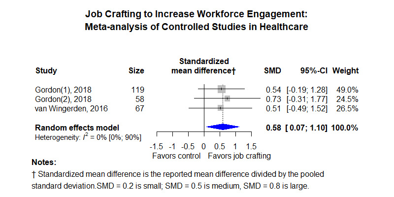

Job crafting
============================================
A living systematic review

Short url: https://ebmgt.github.io/job-crafting/

**Definitions** 
* "Job crafting" is "self-initiated behaviours that employees take to shape, mold, and change their jobs" ([van Leeuwen, 2022](https://doi.org/10.3390/ijerph19095666))​ Another definition is, "workers actively change the actual or perceived characteristics of their jobs in order to better match the demands placed on them and the resources available" (Topa and Aranda-Carmena, 2022 PMID [36232011](http://pubmed.gov/36232011)). Another description is "improving person-job fit" (Kuijpers, 2019 PMID [31829662](http://pubmed.gov/31829662)).
* "Collaborative job crafting" is "[workers] can jointly determine how to modify the work to meet their shared goals" (Topa and Aranda-Carmena, 2022 PMID [36232011](http://pubmed.gov/36232011))​
* "Team job crafting" is the “extent to which team members combine efforts to increase structural and social job resources as well as challenging job demands, and to decrease their hindering job demands” (Dejong et al. J J Appl Psychol. 2024 PMID [39325376](http://pubmed.gov/39325376)
* Job crafting can be combined with "knowledge sharing", such as Googler2Googler (G2) in which the organization helps disseminate successful job crafting.

**Measurement of the occurence of job crafting**

Kuijpers (2019 PMID [31829662](http://pubmed.gov/31829662)) states the following targets or goals of the individual exist and can be measured by the survey of Kooij (2017, PMID [28277726](http://pubmed.gov/28277726)). Crafting towards:
  * Strengths of the individual
  * Interests of the individual
  * Development of the individual
  * Efficiency of the work process via adoption crafting (not part of Kuijpers's model) is the "active and goal-directed use of technology and other sources of knowledge to optimize the work process and is more aimed at doing the job more efficiently than at realizing one’s potential." (Kooij, 2017 PMID [28277726](http://pubmed.gov/28277726))

 Petrou (Petrou et al., 2012 DOI: [10.1002/job.1783](http://doi.org/10.1002/job.1783)), alternatively proposed the Job Crafting Scale which measures the following targets or goals of the individual
 * Challenges (increasing)
 * Resources (increasing)
 * Demands (reduction)

Tims (Tims, 2012 DOI [10.1016/j.jvb.2011.05.009](http://doi.org/10.1016/j.jvb.2011.05.009)) Dutch job crafting scale (JCS) based on the job demands-resources model (Demerouti, 2001 PMID [11419809](http://pubmed.gov/11419809)) measures:
 increasing social job resources, increasing structural job resources, increasing challenging job demands, and decreasing hindering job demands.
* Demands, hindering (decreasing hindering job demands)
* Demands, challenging  (increasing challenging job demands)
* Resources, social
* Resources, structural

**Clinical summary:** Our original objective of this meta-analysis was to measure the impact of job crafting on burnout. Two studies of emotional exhaustion with less than 200 total subjects suggests a '[moderate](https://training.cochrane.org/handbook/current/chapter-15#section-15-5-3-1)' reduction with a standized mean difference (SMD) of -0.49 (interpreting SMDs); however, this insignificant in the small population studied. Additional results are below. 

Heterogeneity of results as measured by I2 '[might not be important](https://training.cochrane.org/handbook/current/chapter-10#section-10-10-2)' at 0% for all outcomes; however very wide confidence intervals reflect the small number of studies and subjects. 

Meta-regression of common modulators (year of publication, study size, event rate in the control groups) has not been done due to the small number of studies.

This review updates previously published meta-analysis(es).(citation[s] below)

* [Reconciliation of studies and conclusions with prior meta-analyses](files/reconciliation-tables/) (under construction)
<!-- * [Keep current with this topic](files/searching/Keep-up.md) -->

Acknowledgement: we acknowledge the essential work by the authors of the prior [systematic review(s)](#systematic-reviews) listed below.

**Methods overview:** This repository is an [openMetaAnalysis](https://openmetaanalysis.github.io/) that combines methods of scoping, rapid, and living systematic reviews.  This analysis updates one or more previously published review(s) below. A comparison of studies included in this review compared to prior reviews are in the table, [reconciliation of trials included with prior meta-analyses/](files/reconciliation-tables/). Newer studies included are listed in the references below. Rationale for newer studies excluded may be listed at the end of the references. 
* [Methods](http://openmetaanalysis.github.io/methods.html) for openMetaAnalysis
* [Evidence search](files/searching/evidence-search.md) for this review (under construction)

**Results:** Details of the studies included are in the:
* [Reconciliation of studies and conclusions with prior meta-analyses](files/reconciliation-tables/) (under construction)
* [Description of studies (PICO table)](files/study-details/table-pico.pdf) (under construction)
* [Risk of bias assessment](files/study-details/table-bias.pdf) (under construction)
* [Forest plots](../master/files/forest-plots) ([spreadsheets with source data](files/data))
<!-- * [Network plots](../master/files/network) (optional) -->

The forest plot for the primary outcomes are below. Additional [forest plots](files/forest-plots) of secondary analyses may be available. 

<!--
The meta-regression for the primary outcomes are below. Additional [meta-regressions](files/metaregression) of secondary analyses may be available.  (under construction)
 

The GRADE Profile is below (under construction).   
-->
References:
----------------------------------

### Systematic review(s)
#### Most recent review at time of last revision of this repository
1. Lai AY, Wee KZ, Frimpong JA. Proactive behaviors and health care workers: A systematic review. Health Care Manage Rev. 2024 PMID: [38757911](http://pubmed.gov/38757911).
2. Cohen C, Pignata S, Bezak E, Tie M, Childs J. Workplace interventions to improve well-being and reduce burnout for nurses, physicians and allied healthcare professionals: a systematic review. BMJ Open. 2023 Jun 29;13(6):e071203. doi: [10.1136/bmjopen-2022-071203](http://doi.org/10.1136/bmjopen-2022-071203). PMID: [37385740](http://pubmed.gov/37385740).
3. Björk JM, Bolander P, Forsman AK. Bottom-Up Interventions Effective in Promoting Work Engagement: A Systematic Review and Meta-Analysis. Front Psychol. 2021;12:730421. PMID: [34566819](http://pubmed.gov/34566819)
4. Oprea BT, Barzin L, Vîrgă D, Iliescu D, Rusu A. Effectiveness of job crafting interventions: a meta-analysis and utility analysis. European Journal of Work and Organizational Psychology. 2019 Nov 2;28(6):723–741. doi: [10.1080/1359432X.2019.1646728](http://dx.doi.org/10.1080/1359432X.2019.1646728) *we have limited our review to studies within this review that were in a healthcare setting*
5. Devotto RP, Wechsler SM. Job Crafting Interventions: Systematic Review. Temas Psicol. 2019;27(2):371–383. DOI: [10.9788/TP2019.2-06](http://doi.org/10.9788/TP2019.2-06)
6. Rudolph CW, Katz IM, Lavigne KN, Zacher H. Job crafting: A meta-analysis of relationships with individual differences, job characteristics, and work outcomes. Journal of vocational behavior. 2017 Oct 1;102:112-38. DOI: [10.1016/j.jvb.2017.05.008](http://doi.org/10.1016/j.jvb.2017.05.008)  *The authors did not have any studies from healthcare*
   
### Randomized controlled trials or quasi-experimental studies
#### New studies *not* included in the most recent review above
1. de Jong JP, De Clippeleer I, De Vos A. Enhancing team crafting through proactive motivation: An intervention study. J Appl Psychol. 2024 Sep 26. doi: 10.1037/apl0001220. Epub ahead of print. PMID: [39325376](http://pubmed.gov/39325376).

#### Studies included in the review(s) above
1.  El-Gazar HE, Abdelhafez S, Ibrahim N, Shawer M, Zoromba MA. Effect of Job Crafting Intervention Program on Harmonious Work Passion and Career Commitment among Nurses: A Randomized Controlled Trial. Mrayyan MT, editor. Journal of Nursing Management. 2023 Jul 13;2023:1–14. DOI: [10.1155/2023/9623866](http://doi.org/10.1155/2023/9623866)
2.  Gordon HJ, Demerouti E, Le Blanc PM, Bakker AB, Bipp T, Verhagen MAMT. Individual job redesign: Job crafting interventions in healthcare. Journal of Vocational Behavior. 2018 Feb;104:98–114.  doi: [10.1016/j.jvb.2017.07.002](http://dx.doi.org/10.1016/j.jvb.2017.07.002) *We extracted emotional exhaustion results from the original trial as this outcome was not reported by Oprea*
3. Kuijpers E, Kooij DTAM, van Woerkom M. Align your job with yourself: The relationship between a job crafting intervention and work engagement, and the role of workload. J Occup Health Psychol. 2020 Feb;25(1):1–16. PMID: [31829662](http://pubmed.gov/31829662)
4. van Leeuwen EH, Knies E, van Rensen ELJ, Taris TW. Stimulating Employability and Job Crafting Behaviour of Physicians: A Randomized Controlled Trial. Int J Environ Res Public Health. 2022 May 6;19(9):5666. doi: 10.3390/ijerph19095666. PMID: [35565061](http://pubmed.gov/35565061). *Outcome measures usable?*
5. Van Wingerden JV, Bakker AB, Derks D. A test of a job demands-resources intervention. Journal of Managerial Psychology. 2016 Apr 11;31(3):686–701. doi: [10.1108/JMP-03-2014-0086](http://dx.doi.org/10.1108/JMP-03-2014-0086)

#### Trial(s) undergoing review

From Harbridge:
1. Baghdadi et al., 2020. DOI [10.1111/jonm.13141](http://doi.org/10.1111/jonm.13141)
2. Llorente-Alonso, et al., 2021; DOI [10.3390/jcm10081614]([url](https:// doi.org/10.3390/jcm10081614))
3. Miller, 2015; https://scholarworks.waldenu.edu/dissertations/1363
4. Oldham & Hackman, 2010; DOI [10.1002/job.678](http://doi.org/10.1002/job.678)
5. Wrzesniewski & Dutton, 2001 DOI [10.5465/amr.2001.4378011](http://doi.org/10.5465/amr.2001.4378011)

#### Studies excluded - selected list of important trial(s)
1. Kooij D, van Woerkom M, Wilkenloh J, Dorenbosch L, Denissen J. A Job Crafting Intervention Study: Increasing Person-Job Fit of Aging Workers. The Gerontologist. 2016 Nov 1;56(Suppl_3):295.  DOI: [10.1093/geront/gnw162.1201](http://doi.org/10.1093/geront/gnw162.1201) *Not in healthcare delivery*
2. Kooij DTAM, van Woerkom M, Wilkenloh J, Dorenbosch L, Denissen JJA. Job crafting towards strengths and interests: The effects of a job crafting intervention on person-job fit and the role of age. J Appl Psychol. 2017 Jun;102(6):971-981. doi: 10.1037/apl0000194. PMID: [28277726](http://pubmed.gov/28277726). *Not in healthcare delivery*
4. Pérez-Marqués M, Letona-Ibañez O, Amillano A, Carrasco M, Martínez-Rodríguez S. Effects of three personal resources interventions on employees’ burnout. Sci Rep. 2023 Dec 6;13(1):21530. PMCID: [PMC10700343](https://www.ncbi.nlm.nih.gov/pmc/articles/PMC10700343/) *No results for healthcare sites*
5. Sakuraya A, Shimazu A, Imamura K, Kawakami N. Effects of a Job Crafting Intervention Program on Work Engagement Among Japanese Employees: A Randomized Controlled Trial. Front Psychol. 2020;11:235. PMCID: [PMC7047874](https://www.ncbi.nlm.nih.gov/pmc/articles/PMC7047874/) *No results for healthcare sites*
6. Topa G, Aranda-Carmena M. Job Crafting in Nursing: Mediation between Work Engagement and Job Performance in a Multisample Study. Int J Environ Res Public Health. 2022 Oct 5;19(19):12711. PMCID: [PMC9566469](https://www.ncbi.nlm.nih.gov/pmc/articles/PMC9566469/) *Study results presented as correlations rather than effect sizes*
7. Dyrbye LN, West CP, Richards ML, Ross HJ, Satele D, Shanafelt TD. A randomized, controlled study of an online intervention to promote job satisfaction and well-being among physicians. Burnout Research. 2016 Sep 1;3(3):69-75. *The intervention was not job crafting but focused more on exercises to build resiliency*
8. Dubbelt L, Demerouti E, Rispens S. The value of job crafting for work engagement, task performance, and career satisfaction: longitudinal and quasi-experimental evidence. European Journal of Work and Organizational Psychology. 2019 May 4;28(3):300-14.*No results for healthcare sites*
9. Van den Heuvel M, Demerouti E, Peeters MC. The job crafting intervention: Effects on job resources, self‐efficacy, and affective well‐being. Journal of occupational and organizational psychology. 2015 Sep;88(3):511-32. DOI: [10.1111/joop.12128(http://doi.org/10.1111/joop.12128).*No results for healthcare sites*
10. Wang H, Li P, Chen S. The Impact of Social Factors on Job Crafting: A Meta-Analysis and Review. Int J Environ Res Public Health. 2020 Oct 30;17(21):8016. doi: 10.3390/ijerph17218016. PMID: 33143286; PMCID: [PMC7662365](https://www.ncbi.nlm.nih.gov/pmc/articles/PMC7662365/). *No results for outcomes of job crdafting.*
11. Harbridge R, Ivanitskaya L, Spreitzer G, Boscart V. Psychological empowerment and job crafting among registered nurses working in public health: A quantitative study. Appl Nurs Res. 2023 Feb;69:151649. doi: 10.1016/j.apnr.2022.151649. Epub 2022 Dec 14. PMID: [36635019](http://pubmed.gov/36635019). *Exclude as cross-sectional*
12. Zhang HL, Liu JH, Ma WJ, Xu XL, Guo XL, Lang HJ. The relationship between job crafting and work engagement among nurses in China: A latent profile analysis. Nurs Open. 2024 Oct;11(10):e70007. doi: 10.1002/nop2.70007. PMID: [39437201](http://pubmed.gov/39437201). *Exclude as cross-sectional*
13. Ghazzawi R, Chasiotis A, Bender M, Daouk-Öyry L, Baumann N. Up for the challenge: Power motive congruence drives nurses to craft their jobs and experience well-being. PLoS One. 2024 Oct 3;19(10):e0310717. doi: 10.1371/journal.pone.0310717. PMID: [39361592](http://pubmed.gov/39361592) *Exclude as cross-sectional without a control group*
14. Bakker AB. Job crafting among health care professionals: The role of work engagement. J Nurs Manag. 2018 Apr;26(3):321-331. doi: 10.1111/jonm.12551. Epub 2017 Oct 9. PMID: [28990295](http://pubmed.gov/28990295).  *Exclude as cross-sectional without a control group*
15. Frögéli E, Rudman A, Ljótsson B, Gustavsson P. Preventing Stress-Related Ill Health Among New Registered Nurses by Supporting Engagement in Proactive Behaviors-A Randomized Controlled Trial. Worldviews Evid Based Nurs. 2020 Jun;17(3):202-212. doi: 10.1111/wvn.12442. Epub 2020 Jun 27. PMID: [32592439](http://pubmed.gov/32592439). *Exclude as not job crafting and not outcomes needed*

#### Systematic review(s) excluded - selected list of important review(s)
1. Holman D, Escaffi‐Schwarz M, Vasquez CA, Irmer JP, Zapf D. Does job crafting affect employee outcomes via job characteristics? A meta‐analytic test of a key job crafting mechanism. Journal of Occupational and Organizational Psychology. 2024 Mar;97(1):47-73. *No results for healthcare sites*

#### Systematic review(s) undergoing review.
1. Lai AY, Wee KZ, Frimpong JA. Proactive behaviors and health care workers: A systematic review. Health Care Manage Rev. 2024 Jul-Sep 01;49(3):239-251. doi: 10.1097/HMR.0000000000000409. Epub 2024 May 17. PMID: [38757911](http://pubmed.gov/38757911).

#### Cited by
This repository is cited by:

1. WikiDoc contributors. Pending content page. WikiDoc. Nov 9, 2014. Available at: http://www.wikidoc.org/index.php/This_topic. Accessed November 9, 2014. 

-------------------------------
[Cite and use this content](https://github.com/openMetaAnalysis/openMetaAnalysis.github.io/blob/master/reusing.MD)  - [Edit this page](../../edit/master/README.md) - [License](files/LICENSE.md) - [History](../../commits/master/README.md)  - 
[Issues and comments](../../issues?q=is%3Aboth+is%3Aissue)
